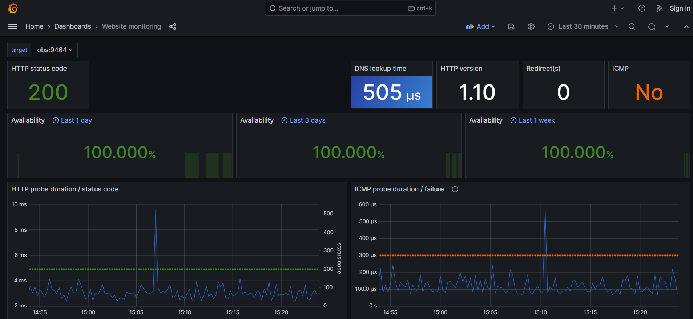

# Import Dashboards in Grafana

## Scope

One of the most important features of Grafana is the ability to create dashboards. Dashboards are a
collection of panels that can be used to visualize data. Dashboards can be created from scratch or
imported from the Grafana dashboard repository.

One goal of the project is to provide some sample dashboards that are imported from startup. Here
you can find the [resource](https://github.com/mbelloiseau/website-monitoring) at GitHub.

## Implementation

### Blackbox Exporter

The two dashboards for website monitoring are based on probing of endpoints over HTTP, HTTPS, DNS,
IMCP and so on. The [Blackbox exporter](https://github.com/prometheus/blackbox_exporter) from
Prometheus is used to allow probing and part of the docker-compose. It uses its own configuration
file (./docker-setup/config/blackbox-exporter.yml) to define the modules (protocols). Example
configuration:

```yaml
modules:
  http_2xx:
    prober: http
    timeout: 5s
    http:
      valid_http_versions: ["HTTP/1.1", "HTTP/2.0"]
      valid_status_codes: []
      method: GET
      preferred_ip_protocol: "ip4"
      ip_protocol_fallback: false 
```

### Prometheus configuration

In addition, two Prometheus jobs are defined in the Prometheus configuration file (
./docker-setup/config/prometheus.yml). These jobs are later used as datasource for dashboards.
Example job configuration:

```yaml
- job_name: http-monitoring         # To get metrics about the exporter’s targets
    metrics_path: /probe            # blackbox exporter opens a few probe_* endpoints
    params:
      module: [http_2xx]            # protocol to use for probing
    static_configs:
      - targets:
          - obs:9464                # Target to probe sample backend application
    relabel_configs:
      - source_labels: [__address__]
        target_label: __param_target
      - source_labels: [__param_target]
        target_label: instance
      - target_label: __address__
        replacement: host.docker.internal:9115  
```

### Dashboards and Grafana volume configuration

The dashboards are stored as json files in the ./docker-setup/config/grafana/provisioning/dashboards
folder. One point to note ist that the datasource (Prometheus job / query) has to be adapted to the
Prometheus job name. In case of exporting a dashboard via Grafana all configurations are saved
correctly.

```json
{
"templating": {
    "list": [
      {
        "hide": 2,
        "label": "http_job",
        "name": "http_job",
        "query": "http-monitoring", #Prometheus job name
        "queryValue": "",
        "skipUrlSync": false,
        "type": "constant"
      }
    ]
  }
}
```

Within the dashboard.yml some meta information and scrape config is stored. These two components
must be added as volumes to Grafana docker-compose configuration.

```yaml
volumes:
  - ./config/grafana/provisioning/dashboards:/var/lib/grafana/dashboard
  - ./config/grafana/provisioning/dashboards/dashboard.yml:/etc/grafana/provisioning/dashboards/dashboard.yaml
```

## Results

