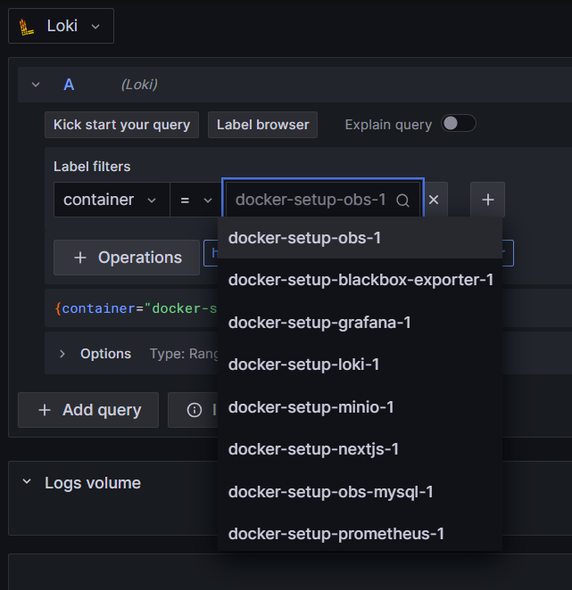
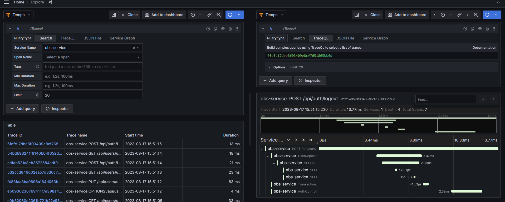

# Explore Loki, Prometheus and Tempo

> Grafana’s dashboard UI is all about building dashboards for visualization. Explore strips away the dashboard and panel options so that you can focus on the query. It helps you iterate until you have a working query and then think about building a dashboard. (Grafana Labs, 2023)

## Explore Loki

Analyze logs from all containers with aggregations, binary operation and formatter.



## Explore Prometheus

Use PromQL to query Prometheus metrics.

### CPU usage backend

```
system_cpu_usage{instance="obs:9464"}
```

### Sum of request duration grouped by uri

```
sum by(uri) (http_server_requests_seconds_sum{instance="obs:9464"})
```

### Sum of request duration grouped by uri and status code

```
sum by(status, uri) (http_server_requests_seconds_count{instance="obs:9464"})
```

## Explore Tempo

Discover traces from Tempo and detect resource intensive operations.


